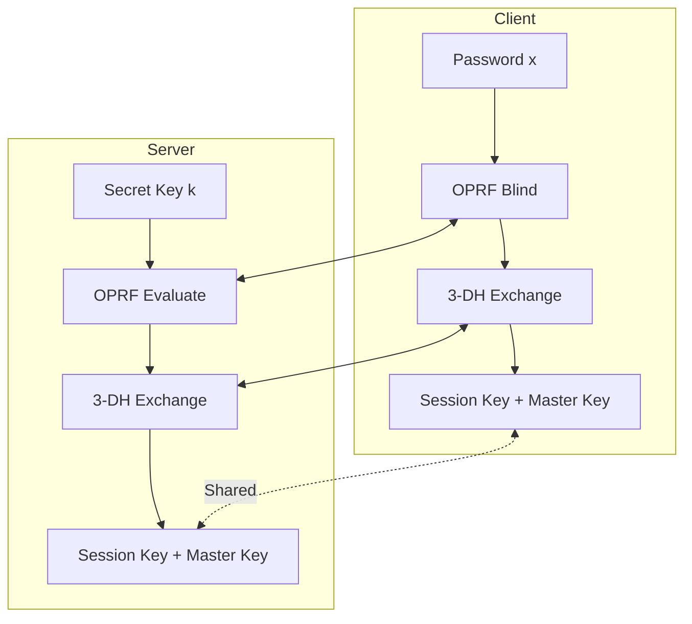
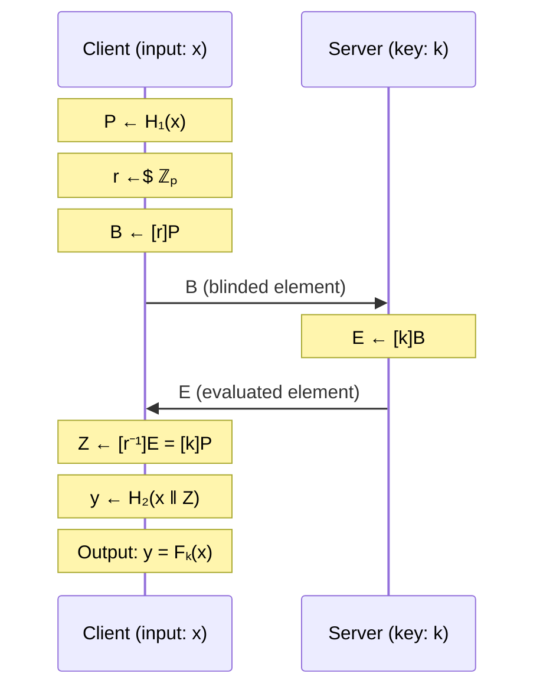
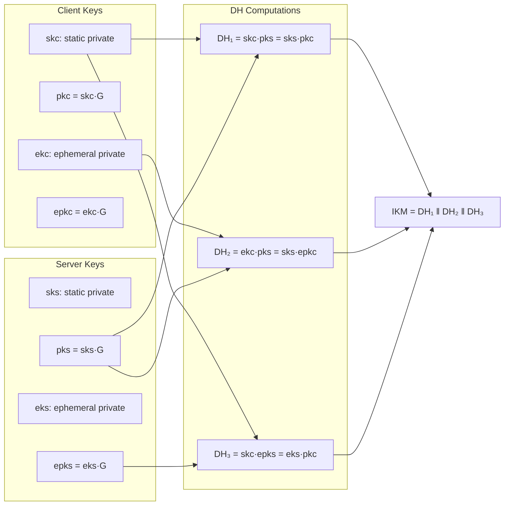
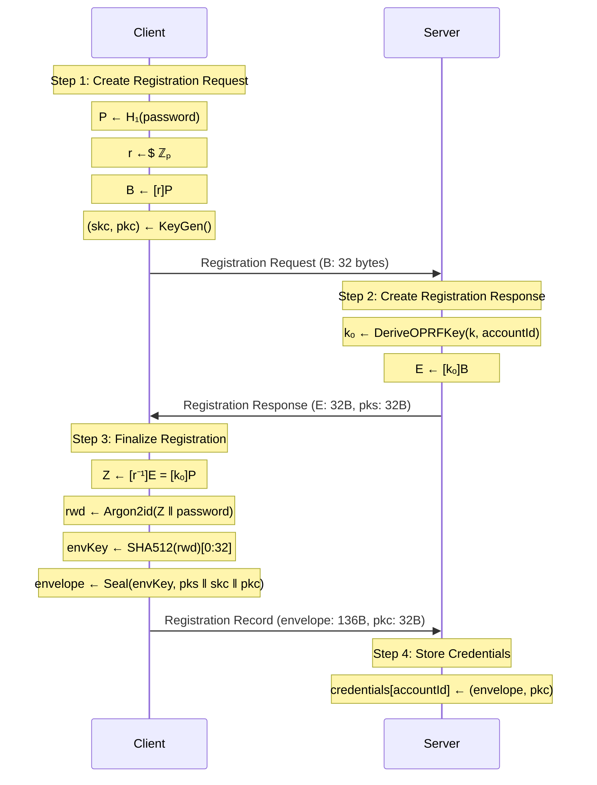
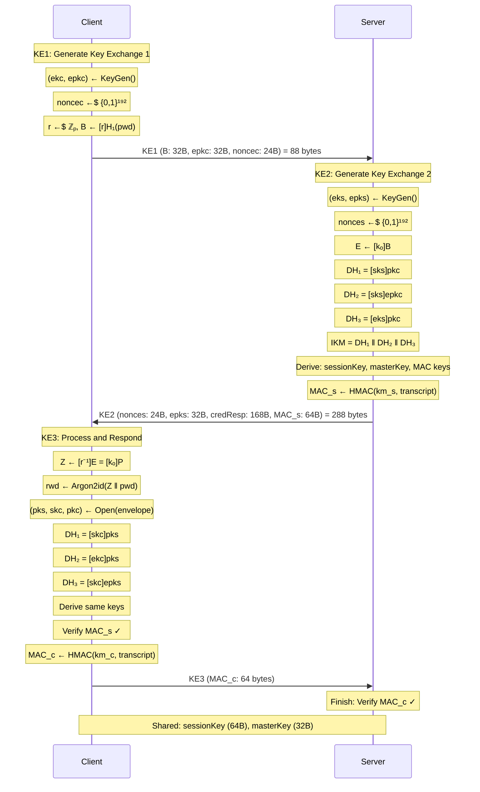
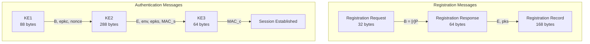
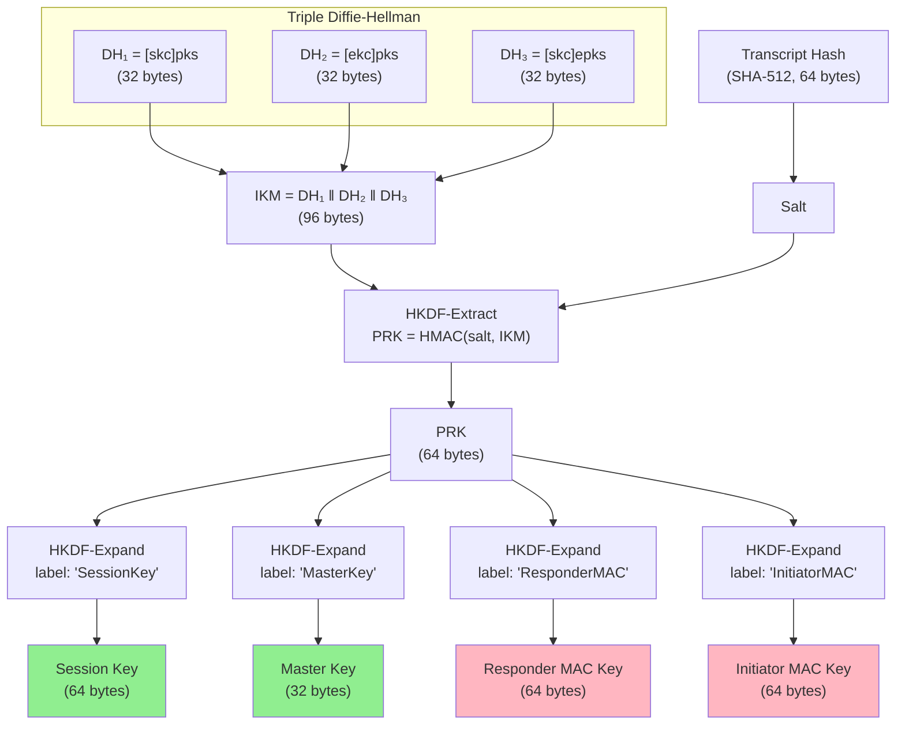
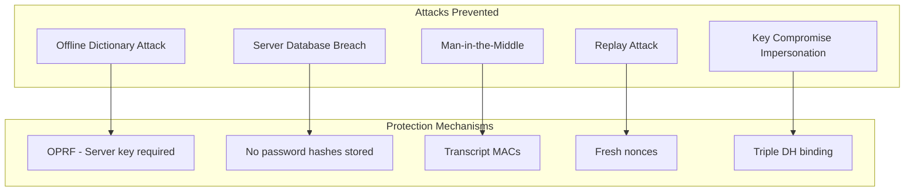

# OPAQUE Protocol: Algorithms & Mathematics

## Table of Contents

1. [Introduction](#1-introduction)
2. [Cryptographic Primitives](#2-cryptographic-primitives)
3. [Mathematical Foundations](#3-mathematical-foundations)
4. [Protocol Flows](#4-protocol-flows)
5. [Message Structures](#5-message-structures)
6. [Key Derivation](#6-key-derivation)
7. [C# API Examples](#7-c-api-examples)
8. [Security Properties](#8-security-properties)
9. [Constants Reference](#9-constants-reference)
10. [Domain Separators](#10-domain-separators)

---

## 1. Introduction

### What is OPAQUE?

OPAQUE (Oblivious Password-Authenticated Key Exchange) is a cryptographic protocol that enables secure password-based authentication without ever exposing the password to the server. Unlike traditional password systems where the server stores password hashes (vulnerable to offline dictionary attacks), OPAQUE uses an Oblivious Pseudorandom Function (OPRF) to ensure that:

1. **The server never learns the password** - Not even during registration
2. **Offline attacks are impossible** - Without the server's secret key, attackers cannot test password guesses
3. **Mutual authentication** - Both client and server verify each other's identity
4. **Forward secrecy** - Compromise of long-term keys doesn't reveal past session keys

### High-Level Architecture

**ASCII Diagram:**
```
┌─────────────────────────────────────────────────────────────────────────────┐
│                         OPAQUE Protocol Architecture                         │
├─────────────────────────────────────────────────────────────────────────────┤
│                                                                             │
│   ┌───────────────┐                              ┌───────────────┐          │
│   │    Client     │                              │    Server     │          │
│   │               │                              │               │          │
│   │  ┌─────────┐  │                              │  ┌─────────┐  │          │
│   │  │Password │  │         Registration         │  │ Secret  │  │          │
│   │  │   (x)   │──┼──────────────────────────────┼─▶│  Key    │  │          │
│   │  └─────────┘  │                              │  │  (k)    │  │          │
│   │       │       │                              │  └─────────┘  │          │
│   │       ▼       │                              │       │       │          │
│   │  ┌─────────┐  │      Authentication          │       ▼       │          │
│   │  │  OPRF   │◀─┼──────────────────────────────┼──┌─────────┐  │          │
│   │  │ Blind   │  │                              │  │  OPRF   │  │          │
│   │  └─────────┘  │                              │  │  Eval   │  │          │
│   │       │       │                              │  └─────────┘  │          │
│   │       ▼       │                              │       │       │          │
│   │  ┌─────────┐  │        Key Exchange          │       ▼       │          │
│   │  │ 3-DH    │◀─┼──────────────────────────────┼──┌─────────┐  │          │
│   │  │Exchange │  │                              │  │  3-DH   │  │          │
│   │  └─────────┘  │                              │  │Exchange │  │          │
│   │       │       │                              │  └─────────┘  │          │
│   │       ▼       │                              │       │       │          │
│   │  ┌─────────┐  │                              │       ▼       │          │
│   │  │Session  │  │      Shared Secret Keys      │  ┌─────────┐  │          │
│   │  │  Key    │◀═┼══════════════════════════════┼═▶│Session  │  │          │
│   │  │Master   │  │                              │  │  Key    │  │          │
│   │  │  Key    │  │                              │  │Master   │  │          │
│   │  └─────────┘  │                              │  │  Key    │  │          │
│   └───────────────┘                              │  └─────────┘  │          │
│                                                  └───────────────┘          │
└─────────────────────────────────────────────────────────────────────────────┘
```

**Mermaid Diagram:**


---

## 2. Cryptographic Primitives

### Overview Table

| Algorithm | Purpose | Library | Output Size |
|-----------|---------|---------|-------------|
| **Ristretto255** | Elliptic curve group | libsodium | 32 bytes |
| **SHA-512** | Cryptographic hash | libsodium | 64 bytes |
| **HMAC-SHA512** | Message authentication | libsodium | 64 bytes |
| **HKDF-SHA512** | Key derivation | Custom/libsodium | Variable |
| **XChaCha20-Poly1305** | Authenticated encryption | libsodium | Variable + 16 bytes tag |
| **Argon2id** | Password stretching | libsodium | Variable |

### 2.1 Ristretto255

Ristretto255 is a prime-order group constructed from Curve25519, designed to eliminate cofactor-related issues and provide a clean abstraction for cryptographic protocols.

**Properties:**
- Prime order group (no cofactor issues)
- 32-byte compressed representation
- Constant-time operations
- Safe against small subgroup attacks

**Implementation:** `src/core/crypto.cpp`

### 2.2 SHA-512

SHA-512 is used for:
- Hash-to-curve operations in OPRF
- Transcript hashing
- Key pair derivation from seeds

**Output:** 64 bytes (512 bits)

### 2.3 HMAC-SHA512

Used for:
- HKDF extract and expand phases
- MAC computation for mutual authentication
- OPRF key derivation

### 2.4 XChaCha20-Poly1305

Authenticated encryption for the envelope containing:
- Server's public key
- Client's private key
- Client's public key

**Parameters:**
- Nonce: 24 bytes (XChaCha20 variant)
- Key: 32 bytes
- Auth tag: 16 bytes

### 2.5 Argon2id

Memory-hard password hashing function used to derive the randomized password from OPRF output.

**Parameters:**
- Operations limit: Moderate
- Memory limit: Moderate
- Output: 64 bytes

---

## 3. Mathematical Foundations

### 3.1 Group Theory Foundation

#### Definition: Prime-Order Group 𝔾

Let 𝔾 be the Ristretto255 prime-order group with the following properties:

**Group Order:**
```
p = 2²⁵² + 27742317777372353535851937790883648493
```

This is the order of the Ristretto255 group, which equals the order of the scalar field.

**Group Elements:**
- **Generator:** G ∈ 𝔾 (fixed base point)
- **Identity:** 𝒪 (point at infinity)

**Group Axioms:**

| Property | Definition |
|----------|------------|
| **Closure** | ∀ P, Q ∈ 𝔾: P + Q ∈ 𝔾 |
| **Associativity** | (P + Q) + R = P + (Q + R) |
| **Identity** | P + 𝒪 = P |
| **Inverse** | ∀ P ∈ 𝔾, ∃ -P: P + (-P) = 𝒪 |
| **Commutativity** | P + Q = Q + P |

**Scalar Field:**
```
ℤₚ = {0, 1, 2, ..., p-1}
```

The scalar field is the set of integers modulo p, used for scalar multiplication.

### 3.2 Scalar Multiplication

**Definition:** For scalar k ∈ ℤₚ and point P ∈ 𝔾:

```
[k]P = P + P + ... + P  (k times)
```

**Efficient Computation (Double-and-Add):**

For k with binary representation k = Σᵢ₌₀ⁿ⁻¹ kᵢ · 2ⁱ:

```
[k]P = Σᵢ₌₀ⁿ⁻¹ kᵢ · [2ⁱ]P
```

**Algorithm:**
```
Input: k ∈ ℤₚ, P ∈ 𝔾
Output: Q = [k]P

Q ← 𝒪
R ← P
for i from 0 to n-1:
    if kᵢ = 1:
        Q ← Q + R
    R ← R + R  (point doubling)
return Q
```

### 3.3 Cryptographic Assumptions

#### Discrete Logarithm Problem (DLP)

**Definition:** Given P, Q ∈ 𝔾, find k ∈ ℤₚ such that Q = [k]P.

**Security Assumption:** DLP is computationally infeasible in 𝔾 for properly generated groups.

**Formal Statement:**
```
∀ PPT adversary A:
    Pr[A(G, P, [k]P) = k : k ←$ ℤₚ, P ←$ 𝔾] ≤ negl(λ)
```

where PPT = Probabilistic Polynomial Time, negl(λ) is a negligible function in security parameter λ.

#### Computational Diffie-Hellman (CDH)

**Definition:** Given G, [a]G, [b]G ∈ 𝔾, compute [ab]G.

**Security Assumption:** CDH is hard without knowing a or b.

**Formal Statement:**
```
∀ PPT adversary A:
    Pr[A(G, [a]G, [b]G) = [ab]G : a,b ←$ ℤₚ] ≤ negl(λ)
```

#### Decisional Diffie-Hellman (DDH)

**Definition:** Distinguish ([a]G, [b]G, [ab]G) from ([a]G, [b]G, [c]G) where c ←$ ℤₚ.

**Note:** Ristretto255 satisfies DDH assumption due to its prime-order structure.

### 3.4 Oblivious Pseudorandom Function (OPRF)

#### Formal Definition

An OPRF is a two-party protocol between a client (with input x) and a server (with key k) that computes Fₖ(x) such that:

1. **Client learns:** Only Fₖ(x)
2. **Server learns:** Nothing about x
3. **Pseudorandomness:** Output is indistinguishable from random without k

#### Mathematical Specification

**Functions:**
- H₁: {0,1}* → 𝔾 (hash-to-curve)
- H₂: {0,1}* → {0,1}⁵¹² (SHA-512)

**Protocol:**

```
╔═══════════════════════════════════════════════════════════════════════════╗
║                           OPRF Protocol                                    ║
╠═══════════════════════════════════════════════════════════════════════════╣
║                                                                           ║
║  Client Input: x (password)                                               ║
║  Server Input: k ∈ ℤₚ (OPRF key)                                          ║
║                                                                           ║
║  Step 1 - Hash-to-Group (Client):                                         ║
║      P ← H₁(x)                                                            ║
║      P ∈ 𝔾                                                                ║
║                                                                           ║
║  Step 2 - Blind (Client):                                                 ║
║      r ←$ ℤₚ                    (random scalar)                           ║
║      B ← [r]P                   (blinded element)                         ║
║      B ∈ 𝔾                                                                ║
║                                                                           ║
║  Step 3 - Evaluate (Server):                                              ║
║      E ← [k]B                   (evaluated element)                       ║
║      E = [k][r]P = [kr]P                                                  ║
║      E ∈ 𝔾                                                                ║
║                                                                           ║
║  Step 4 - Unblind (Client):                                               ║
║      r⁻¹ ← r⁻¹ mod p            (modular inverse)                         ║
║      Z ← [r⁻¹]E                                                           ║
║      Z = [r⁻¹][kr]P = [k]P                                                ║
║                                                                           ║
║  Step 5 - Finalize (Client):                                              ║
║      y ← H₂(x ‖ Z)                                                        ║
║      y ∈ {0,1}⁵¹²                                                         ║
║                                                                           ║
║  Output: y = Fₖ(x)                                                        ║
║                                                                           ║
╚═══════════════════════════════════════════════════════════════════════════╝
```

**Mermaid Diagram:**


#### Security Properties

**Theorem (Obliviousness):** The server's view of the protocol is independent of x.

*Proof Sketch:* Since r is uniformly random in ℤₚ, B = [r]P is uniformly distributed in 𝔾 regardless of P. Thus, the server sees a uniformly random group element.

**Theorem (Pseudorandomness):** Without k, the output y is computationally indistinguishable from random.

*Proof Sketch:* Follows from the DDH assumption. Computing [k]P without k is equivalent to solving CDH.

### 3.5 Triple Diffie-Hellman (3DH)

#### Key Pairs

**Client:**
- Static key pair: (skc, pkc) where pkc = [skc]G
- Ephemeral key pair: (ekc, epkc) where epkc = [ekc]G

**Server:**
- Static key pair: (sks, pks) where pks = [sks]G
- Ephemeral key pair: (eks, epks) where epks = [eks]G

#### Shared Secret Computation

Three independent Diffie-Hellman computations:

```
╔═══════════════════════════════════════════════════════════════════════════╗
║                    Triple Diffie-Hellman (3DH)                            ║
╠═══════════════════════════════════════════════════════════════════════════╣
║                                                                           ║
║  DH₁ (Static-Static):                                                     ║
║      Client computes: [skc]pks = [skc][sks]G                              ║
║      Server computes: [sks]pkc = [sks][skc]G                              ║
║      Result: DH₁ = [skc·sks]G                                             ║
║                                                                           ║
║  DH₂ (Ephemeral-Static):                                                  ║
║      Client computes: [ekc]pks = [ekc][sks]G                              ║
║      Server computes: [sks]epkc = [sks][ekc]G                             ║
║      Result: DH₂ = [ekc·sks]G                                             ║
║                                                                           ║
║  DH₃ (Static-Ephemeral):                                                  ║
║      Client computes: [skc]epks = [skc][eks]G                             ║
║      Server computes: [eks]pkc = [eks][skc]G                              ║
║      Result: DH₃ = [skc·eks]G                                             ║
║                                                                           ║
║  Combined Input Keying Material:                                          ║
║      IKM = DH₁ ‖ DH₂ ‖ DH₃                                                ║
║      IKM ∈ {0,1}⁷⁶⁸ (96 bytes)                                            ║
║                                                                           ║
╚═══════════════════════════════════════════════════════════════════════════╝
```

**Mermaid Diagram:**


#### Forward Secrecy Analysis

**Theorem:** Compromise of static keys (skc, sks) does not reveal past session keys.

*Proof:*
1. Session keys are derived from IKM = DH₁ ‖ DH₂ ‖ DH₃
2. DH₂ and DH₃ involve ephemeral keys (ekc, eks)
3. Ephemeral keys are destroyed after each session
4. Without ekc or eks, attacker cannot compute DH₂ or DH₃
5. Therefore, past session keys remain secure

### 3.6 HKDF (HMAC-based Key Derivation Function)

#### RFC 5869 Specification

**Definition:** HKDF(salt, IKM, info, L) → OKM

Where:
- salt: Optional salt value
- IKM: Input Keying Material
- info: Context and application-specific information
- L: Length of output keying material
- OKM: Output Keying Material

#### Extract Phase

```
PRK = HMAC-Hash(salt, IKM)
```

Where:
- Hash = SHA-512
- PRK ∈ {0,1}⁵¹² (512 bits)

**Purpose:** Extract a fixed-length pseudorandom key from variable-length input.

#### Expand Phase

```
N = ⌈L/HashLen⌉
T₀ = ε (empty string)
T₁ = HMAC-Hash(PRK, T₀ ‖ info ‖ 0x01)
T₂ = HMAC-Hash(PRK, T₁ ‖ info ‖ 0x02)
⋮
Tₙ = HMAC-Hash(PRK, Tₙ₋₁ ‖ info ‖ N)

OKM = first L bytes of (T₁ ‖ T₂ ‖ ... ‖ Tₙ)
```

**Purpose:** Expand PRK into arbitrary-length output using different labels.

### 3.7 Authenticated Encryption (ChaCha20-Poly1305)

#### XChaCha20-Poly1305 AEAD

**Encryption:** Seal(K, N, P, A) → (C, T)

```
Parameters:
    K: 256-bit key
    N: 192-bit nonce (XChaCha20 variant)
    P: Plaintext (arbitrary length)
    A: Associated data (optional, empty in OPAQUE)

Output:
    C: Ciphertext (|C| = |P|)
    T: 128-bit authentication tag

Process:
    1. Derive subkey from K and first 128 bits of N
    2. Encrypt P using ChaCha20 with subkey and remaining nonce
    3. Compute Poly1305 MAC over A ‖ C
```

**Decryption:** Open(K, N, C, T, A) → P or ⊥

```
Process:
    1. Verify Poly1305 MAC
    2. If MAC invalid: return ⊥ (failure)
    3. Decrypt C using ChaCha20
    4. Return P
```

**Security:** IND-CCA2 (Indistinguishability under Adaptive Chosen Ciphertext Attack)

---

## 4. Protocol Flows

### 4.1 Registration Flow

The registration flow establishes the client's credentials on the server without revealing the password.

**ASCII Diagram:**
```
┌──────────────────┐                                    ┌──────────────────┐
│      Client      │                                    │      Server      │
│                  │                                    │                  │
│  Input: password │                                    │  Input: secret k │
└────────┬─────────┘                                    └────────┬─────────┘
         │                                                       │
         │  ┌─────────────────────────────────────────────┐      │
         │  │ Step 1: Create Registration Request         │      │
         │  │   P ← H₁(password)                          │      │
         │  │   r ←$ ℤₚ                                   │      │
         │  │   B ← [r]P                                  │      │
         │  │   (skc, pkc) ← KeyGen()                     │      │
         │  └─────────────────────────────────────────────┘      │
         │                                                       │
         │─────────────── Registration Request ─────────────────▶│
         │                   (B: 32 bytes)                       │
         │                                                       │
         │                    ┌───────────────────────────────────┤
         │                    │ Step 2: Create Registration Resp. │
         │                    │   kₒ ← DeriveOPRFKey(k, accountId)│
         │                    │   E ← [kₒ]B                       │
         │                    └───────────────────────────────────┤
         │                                                       │
         │◀────────────── Registration Response ─────────────────│
         │            (E: 32 bytes, pks: 32 bytes)               │
         │                                                       │
         │  ┌─────────────────────────────────────────────┐      │
         │  │ Step 3: Finalize Registration               │      │
         │  │   Z ← [r⁻¹]E                                │      │
         │  │   rwd ← Argon2id(Z ‖ password)              │      │
         │  │   envKey ← H(rwd)                           │      │
         │  │   envelope ← Seal(envKey, pks ‖ skc ‖ pkc)  │      │
         │  └─────────────────────────────────────────────┘      │
         │                                                       │
         │─────────────── Registration Record ──────────────────▶│
         │         (envelope: 136 bytes, pkc: 32 bytes)          │
         │                                                       │
         │                    ┌───────────────────────────────────┤
         │                    │ Step 4: Store Credentials         │
         │                    │   credentials[accountId] ←        │
         │                    │     (envelope, pkc)               │
         │                    └───────────────────────────────────┤
         │                                                       │
         ▼                                                       ▼
```

**Mermaid Diagram:**


### 4.2 Authentication Flow

The authentication flow verifies the client's identity and establishes shared session keys.

**ASCII Diagram:**
```
┌──────────────────┐                                    ┌──────────────────┐
│      Client      │                                    │      Server      │
│                  │                                    │                  │
│  Input: password │                                    │  Input: creds    │
└────────┬─────────┘                                    └────────┬─────────┘
         │                                                       │
         │  ┌─────────────────────────────────────────────┐      │
         │  │ KE1: Key Exchange Message 1                 │      │
         │  │   (ekc, epkc) ← KeyGen()                    │      │
         │  │   noncec ←$ {0,1}¹⁹²                        │      │
         │  │   P ← H₁(password)                          │      │
         │  │   r ←$ ℤₚ                                   │      │
         │  │   B ← [r]P                                  │      │
         │  └─────────────────────────────────────────────┘      │
         │                                                       │
         │══════════════════════ KE1 ══════════════════════════▶│
         │        (B: 32B, epkc: 32B, noncec: 24B)               │
         │                        88 bytes total                 │
         │                                                       │
         │                    ┌───────────────────────────────────┤
         │                    │ KE2: Key Exchange Message 2       │
         │                    │   (eks, epks) ← KeyGen()          │
         │                    │   nonces ←$ {0,1}¹⁹²              │
         │                    │   E ← [kₒ]B                       │
         │                    │                                   │
         │                    │   DH₁ ← [sks]pkc                  │
         │                    │   DH₂ ← [sks]epkc                 │
         │                    │   DH₃ ← [eks]pkc                  │
         │                    │   IKM ← DH₁ ‖ DH₂ ‖ DH₃           │
         │                    │                                   │
         │                    │   transcript ← Hash(context ‖     │
         │                    │     epkc ‖ epks ‖ noncec ‖        │
         │                    │     nonces ‖ pkc ‖ pks ‖ credResp)│
         │                    │                                   │
         │                    │   PRK ← HKDF-Extract(trans, IKM)  │
         │                    │   sessionKey ← HKDF-Expand(PRK,   │
         │                    │     "SessionKey", 64)             │
         │                    │   masterKey ← HKDF-Expand(PRK,    │
         │                    │     "MasterKey", 32)              │
         │                    │   km_s ← HKDF-Expand(PRK,         │
         │                    │     "ResponderMAC", 64)           │
         │                    │   km_c ← HKDF-Expand(PRK,         │
         │                    │     "InitiatorMAC", 64)           │
         │                    │                                   │
         │                    │   MAC_s ← HMAC(km_s, macInput)    │
         │                    └───────────────────────────────────┤
         │                                                       │
         │◀═════════════════════ KE2 ═══════════════════════════│
         │  (nonces: 24B, epks: 32B, credResp: 168B, MAC_s: 64B) │
         │                      288 bytes total                  │
         │                                                       │
         │  ┌─────────────────────────────────────────────┐      │
         │  │ KE3: Key Exchange Message 3                 │      │
         │  │   Z ← [r⁻¹]E                                │      │
         │  │   rwd ← Argon2id(Z ‖ password)              │      │
         │  │   (pks, skc, pkc) ← Open(envKey, envelope)  │      │
         │  │                                             │      │
         │  │   DH₁ ← [skc]pks                            │      │
         │  │   DH₂ ← [ekc]pks                            │      │
         │  │   DH₃ ← [skc]epks                           │      │
         │  │   IKM ← DH₁ ‖ DH₂ ‖ DH₃                     │      │
         │  │                                             │      │
         │  │   ... derive same keys as server ...        │      │
         │  │                                             │      │
         │  │   Verify: MAC_s ?= HMAC(km_s, macInput)     │      │
         │  │   MAC_c ← HMAC(km_c, macInput)              │      │
         │  └─────────────────────────────────────────────┘      │
         │                                                       │
         │══════════════════════ KE3 ══════════════════════════▶│
         │                  (MAC_c: 64 bytes)                    │
         │                                                       │
         │                    ┌───────────────────────────────────┤
         │                    │ Finish:                           │
         │                    │   Verify: MAC_c ?= expected       │
         │                    │   If valid: Auth success          │
         │                    └───────────────────────────────────┤
         │                                                       │
         ├═══════════════════════════════════════════════════════┤
         │            Shared: sessionKey (64 bytes)              │
         │            Shared: masterKey (32 bytes)               │
         └═══════════════════════════════════════════════════════┘
```

**Mermaid Diagram:**


---

## 5. Message Structures

### 5.1 Registration Messages

**Registration Request (32 bytes):**
```
┌────────────────────────────────────────────────────────────────┐
│                    Blinded Element B                           │
│                        (32 bytes)                              │
│                                                                │
│    B = [r]H₁(password) where r ←$ ℤₚ                           │
└────────────────────────────────────────────────────────────────┘
```

**Registration Response (64 bytes):**
```
┌────────────────────────────────┬───────────────────────────────┐
│      Evaluated Element E       │     Server Public Key pks     │
│          (32 bytes)            │          (32 bytes)           │
│                                │                               │
│     E = [kₒ]B = [kₒ·r]P        │      pks = [sks]G             │
└────────────────────────────────┴───────────────────────────────┘
```

**Registration Record (168 bytes):**
```
┌────────────────────────────────────────────────────────────────────────────┐
│                           Envelope (136 bytes)                             │
│  ┌──────────────┬─────────────────────────────────────┬─────────────────┐  │
│  │  Nonce       │          Ciphertext                 │   Auth Tag      │  │
│  │  (24 bytes)  │          (96 bytes)                 │   (16 bytes)    │  │
│  │              │                                     │                 │  │
│  │  N ←$ {0,1}¹⁹²│  Enc(pks ‖ skc ‖ pkc)              │  Poly1305 tag   │  │
│  └──────────────┴─────────────────────────────────────┴─────────────────┘  │
├────────────────────────────────────────────────────────────────────────────┤
│                      Client Public Key pkc (32 bytes)                      │
│                                                                            │
│                          pkc = [skc]G                                      │
└────────────────────────────────────────────────────────────────────────────┘
```

**Envelope Plaintext Structure (96 bytes):**
```
┌─────────────────────┬─────────────────────┬─────────────────────┐
│  Server Public Key  │  Client Private Key │  Client Public Key  │
│     pks (32B)       │     skc (32B)       │     pkc (32B)       │
└─────────────────────┴─────────────────────┴─────────────────────┘
```

### 5.2 Authentication Messages

**KE1 - Key Exchange Message 1 (88 bytes):**
```
┌────────────────────────┬────────────────────────┬──────────────────┐
│   Blinded Element B    │   Ephemeral Public Key │   Client Nonce   │
│       (32 bytes)       │   epkc (32 bytes)      │    (24 bytes)    │
│                        │                        │                  │
│  B = [r]H₁(password)   │    epkc = [ekc]G       │   noncec ←$ {0,1}¹⁹²│
└────────────────────────┴────────────────────────┴──────────────────┘
```

**KE2 - Key Exchange Message 2 (288 bytes):**
```
┌──────────────────┬────────────────────────┬─────────────────────────────────┐
│   Server Nonce   │   Ephemeral Public Key │      Credential Response        │
│    (24 bytes)    │   epks (32 bytes)      │         (168 bytes)             │
│                  │                        │                                 │
│  nonces ←$ {0,1}¹⁹²│   epks = [eks]G       │                                 │
├──────────────────┴────────────────────────┴─────────────────────────────────┤
│                         Credential Response Detail:                         │
│  ┌─────────────────────────┬───────────────────────────────────────────┐    │
│  │  Evaluated Element E    │              Envelope                     │    │
│  │      (32 bytes)         │            (136 bytes)                    │    │
│  └─────────────────────────┴───────────────────────────────────────────┘    │
├─────────────────────────────────────────────────────────────────────────────┤
│                          Server MAC (64 bytes)                              │
│                                                                             │
│                   MAC_s = HMAC-SHA512(km_s, transcript)                     │
└─────────────────────────────────────────────────────────────────────────────┘
```

**KE3 - Key Exchange Message 3 (64 bytes):**
```
┌─────────────────────────────────────────────────────────────────────────────┐
│                          Client MAC (64 bytes)                              │
│                                                                             │
│                   MAC_c = HMAC-SHA512(km_c, transcript)                     │
└─────────────────────────────────────────────────────────────────────────────┘
```

### 5.3 Mermaid Structure Diagrams



---

## 6. Key Derivation

### 6.1 Key Derivation Flow

**ASCII Diagram:**
```
                           ┌─────────────────────────────┐
                           │    Triple DH Components     │
                           │                             │
                           │  DH₁ = [skc·sks]G (32B)     │
                           │  DH₂ = [ekc·sks]G (32B)     │
                           │  DH₃ = [skc·eks]G (32B)     │
                           │                             │
                           └─────────────┬───────────────┘
                                         │
                                         ▼
                           ┌─────────────────────────────┐
                           │    Input Keying Material    │
                           │    IKM = DH₁ ‖ DH₂ ‖ DH₃    │
                           │        (96 bytes)           │
                           └─────────────┬───────────────┘
                                         │
                                         │
    ┌────────────────────────────────────┼────────────────────────────────────┐
    │                                    │                                    │
    │                                    ▼                                    │
    │  ┌─────────────────┐    ┌─────────────────────────┐                     │
    │  │   Transcript    │───▶│     HKDF-Extract        │                     │
    │  │     Hash        │    │                         │                     │
    │  │   (64 bytes)    │    │  PRK = HMAC(salt, IKM)  │                     │
    │  │                 │    │      (64 bytes)         │                     │
    │  └─────────────────┘    └───────────┬─────────────┘                     │
    │                                     │                                    │
    │         ┌───────────────────────────┼───────────────────────────┐       │
    │         │                           │                           │       │
    │         ▼                           ▼                           ▼       │
    │  ┌─────────────────┐      ┌─────────────────┐      ┌─────────────────┐  │
    │  │  HKDF-Expand    │      │  HKDF-Expand    │      │  HKDF-Expand    │  │
    │  │  "SessionKey"   │      │  "MasterKey"    │      │  "ResponderMAC" │  │
    │  └────────┬────────┘      └────────┬────────┘      └────────┬────────┘  │
    │           │                        │                        │           │
    │           ▼                        ▼                        ▼           │
    │  ┌─────────────────┐      ┌─────────────────┐      ┌─────────────────┐  │
    │  │   Session Key   │      │   Master Key    │      │  Responder MAC  │  │
    │  │   (64 bytes)    │      │   (32 bytes)    │      │  Key (64 bytes) │  │
    │  └─────────────────┘      └─────────────────┘      └─────────────────┘  │
    │                                                                         │
    │                                    ┌─────────────────┐                   │
    │                                    │  HKDF-Expand    │                   │
    │                                    │  "InitiatorMAC" │                   │
    │                                    └────────┬────────┘                   │
    │                                             │                            │
    │                                             ▼                            │
    │                                    ┌─────────────────┐                   │
    │                                    │  Initiator MAC  │                   │
    │                                    │  Key (64 bytes) │                   │
    │                                    └─────────────────┘                   │
    │                                                                         │
    └─────────────────────────────────────────────────────────────────────────┘
```

**Mermaid Diagram:**


### 6.2 Transcript Construction

The transcript binds all protocol messages to prevent replay and tampering:

```
transcript = Hash(
    context_label ‖
    initiator_ephemeral_public_key ‖
    responder_ephemeral_public_key ‖
    initiator_nonce ‖
    responder_nonce ‖
    initiator_static_public_key ‖
    responder_static_public_key ‖
    credential_response
)
```

### 6.3 MAC Computation

**Responder MAC (Server → Client):**
```
macInput = epkc ‖ epks ‖ noncec ‖ nonces ‖ pkc ‖ pks ‖ credentialResponse
MAC_s = HMAC-SHA512(km_s, macInput)
```

**Initiator MAC (Client → Server):**
```
MAC_c = HMAC-SHA512(km_c, macInput)
```

---

## 7. C# API Examples

### 7.1 Server Setup

```csharp
using Ecliptix.OPAQUE.Server;

// Option 1: Generate random keypair
using var keyPair = ServerKeyPair.Generate();

// Option 2: Derive from seed (deterministic)
byte[] seed = new byte[32]; // Your secure seed
using var keyPair = ServerKeyPair.DeriveFromSeed(seed);

// Option 3: Load existing keys
byte[] privateKey = LoadPrivateKey();
byte[] publicKey = LoadPublicKey();
using var keyPair = ServerKeyPair.FromKeys(privateKey, publicKey);

// Get public key to share with clients
byte[] serverPublicKey = keyPair.GetPublicKeyCopy();
```

### 7.2 Registration Flow

**Client Side:**
```csharp
using Ecliptix.OPAQUE.Client;

// Initialize client with server's public key
byte[] serverPublicKey = await FetchServerPublicKey();
using var client = new OpaqueClient(serverPublicKey);

// Step 1: Create registration request
byte[] password = Encoding.UTF8.GetBytes("MySecurePassword123!");
using var regState = client.CreateRegistrationRequest(password);
byte[] request = regState.GetRequestCopy();  // 32 bytes

// Send request to server, receive response
byte[] response = await SendToServer("/register/start", request);

// Step 2: Finalize registration
byte[] registrationRecord = client.FinalizeRegistration(response, regState);
// registrationRecord is 168 bytes

// Send record to server for storage
await SendToServer("/register/finish", registrationRecord);
```

**Server Side:**
```csharp
using Ecliptix.OPAQUE.Server;

// Handle registration request
[HttpPost("/register/start")]
public byte[] StartRegistration(byte[] request, string accountId)
{
    using var server = OpaqueServer.Create(keyPair);
    byte[] accountIdBytes = Encoding.UTF8.GetBytes(accountId);

    // Generate registration response (64 bytes)
    return server.CreateRegistrationResponse(request, accountIdBytes);
}

// Handle registration completion
[HttpPost("/register/finish")]
public void FinishRegistration(byte[] record, string accountId)
{
    // Store the 168-byte registration record
    database.StoreCredentials(accountId, record);
}
```

### 7.3 Authentication Flow

**Client Side:**
```csharp
using Ecliptix.OPAQUE.Client;

// Initialize client
using var client = new OpaqueClient(serverPublicKey);

// Step 1: Generate KE1
byte[] password = Encoding.UTF8.GetBytes("MySecurePassword123!");
using var keState = client.GenerateKe1(password);
byte[] ke1 = keState.GetKeyExchangeDataCopy();  // 88 bytes

// Send KE1 to server, receive KE2
byte[] ke2 = await SendToServer("/auth/ke1", ke1);  // 288 bytes

// Step 2: Generate KE3 and verify server
var (result, ke3) = client.GenerateKe3(ke2, keState);
if (result != OpaqueResult.SUCCESS)
{
    throw new AuthenticationException("Authentication failed: " + result);
}

// Send KE3 to server
var success = await SendToServer("/auth/ke3", ke3);  // 64 bytes

// Step 3: Derive session keys
var (sessionKey, masterKey) = client.DeriveBaseMasterKey(keState);

// sessionKey: 64 bytes - use for session encryption
// masterKey: 32 bytes - use for deriving additional keys
```

**Server Side:**
```csharp
using Ecliptix.OPAQUE.Server;

// Handle KE1
[HttpPost("/auth/ke1")]
public byte[] HandleKe1(byte[] ke1, string accountId)
{
    using var server = OpaqueServer.Create(keyPair);
    byte[] accountIdBytes = Encoding.UTF8.GetBytes(accountId);

    // Load stored credentials
    byte[] credentials = database.GetCredentials(accountId);  // 168 bytes

    // Create authentication state
    using var authState = AuthenticationState.Create();

    // Store auth state for KE3 (in session or cache)
    StoreAuthState(accountId, authState);

    // Generate KE2 (288 bytes)
    return server.GenerateKe2(ke1, accountIdBytes, credentials, authState);
}

// Handle KE3
[HttpPost("/auth/ke3")]
public AuthResult HandleKe3(byte[] ke3, string accountId)
{
    using var server = OpaqueServer.Create(keyPair);

    // Retrieve auth state
    using var authState = GetAuthState(accountId);

    // Verify KE3 and get keys
    DerivedKeys? keys = server.FinishAuthentication(ke3, authState);

    if (keys == null)
    {
        return new AuthResult { Success = false };
    }

    // Authentication successful!
    return new AuthResult
    {
        Success = true,
        SessionKey = keys.Value.SessionKey,  // 64 bytes
        MasterKey = keys.Value.MasterKey     // 32 bytes
    };
}
```

### 7.4 Error Handling

```csharp
using Ecliptix.OPAQUE.Server;

try
{
    var keys = server.FinishAuthentication(ke3, authState);
    if (keys == null)
    {
        // Wrong password or tampered message
        throw new AuthenticationException("Invalid credentials");
    }
}
catch (OpaqueException ex)
{
    switch (ex.ResultCode)
    {
        case OpaqueResult.InvalidInput:
            // Malformed input data
            break;
        case OpaqueResult.CryptoError:
            // Cryptographic operation failed
            break;
        case OpaqueResult.ValidationError:
            // Input validation failed
            break;
        case OpaqueResult.AuthenticationError:
            // Authentication specifically failed
            break;
        case OpaqueResult.InvalidPublicKey:
            // Invalid public key format
            break;
    }
}
```

### 7.5 Complete Example

```csharp
public class OpaqueAuthService
{
    private readonly ServerKeyPair _keyPair;
    private readonly ICredentialStore _store;

    public OpaqueAuthService(byte[] serverSeed, ICredentialStore store)
    {
        _keyPair = ServerKeyPair.DeriveFromSeed(serverSeed);
        _store = store;
    }

    public byte[] GetPublicKey() => _keyPair.GetPublicKeyCopy();

    public async Task<bool> RegisterAsync(string userId, byte[] password)
    {
        // Client-side operations (in real app, this runs on client)
        using var client = new OpaqueClient(_keyPair.GetPublicKeyCopy());

        // Step 1: Create request
        using var regState = client.CreateRegistrationRequest(password);

        // Step 2: Server creates response
        using var server = OpaqueServer.Create(_keyPair);
        byte[] response = server.CreateRegistrationResponse(
            regState.GetRequestCopy(),
            Encoding.UTF8.GetBytes(userId)
        );

        // Step 3: Client finalizes
        byte[] record = client.FinalizeRegistration(response, regState);

        // Step 4: Store credentials
        await _store.SaveAsync(userId, record);
        return true;
    }

    public async Task<(byte[] SessionKey, byte[] MasterKey)?> AuthenticateAsync(
        string userId, byte[] password)
    {
        // Load credentials
        byte[] credentials = await _store.LoadAsync(userId);
        if (credentials == null) return null;

        // Client generates KE1
        using var client = new OpaqueClient(_keyPair.GetPublicKeyCopy());
        using var keState = client.GenerateKe1(password);

        // Server generates KE2
        using var server = OpaqueServer.Create(_keyPair);
        using var authState = AuthenticationState.Create();
        byte[] ke2 = server.GenerateKe2(
            keState.GetKeyExchangeDataCopy(),
            Encoding.UTF8.GetBytes(userId),
            credentials,
            authState
        );

        // Client generates KE3
        var (result, ke3) = client.GenerateKe3(ke2, keState);
        if (result != OpaqueResult.SUCCESS) return null;

        // Server verifies
        var keys = server.FinishAuthentication(ke3, authState);
        if (keys == null) return null;

        // Get client keys
        var (sessionKey, masterKey) = client.DeriveBaseMasterKey(keState);

        return (sessionKey, masterKey);
    }
}
```

---

## 8. Security Properties

### 8.1 Security Guarantees

| Property | Description | Mechanism |
|----------|-------------|-----------|
| **Forward Secrecy** | Compromise of long-term keys doesn't reveal past sessions | Ephemeral DH keys (DH₂, DH₃) |
| **Mutual Authentication** | Both parties verify each other's identity | Bi-directional MAC verification |
| **Offline Attack Resistance** | Attacker cannot test passwords without server | OPRF requires server's secret key |
| **Server Compromise Resistance** | Server breach doesn't directly leak passwords | Server stores only verifiers |
| **MITM Protection** | Man-in-the-middle attacks are detected | Transcript-based MACs |
| **Replay Protection** | Old messages cannot be reused | Fresh nonces in each session |

### 8.2 Attack Resistance Analysis

**Mermaid Diagram:**


### 8.3 Constant-Time Operations

All sensitive operations use constant-time implementations:

```c
// From libsodium
crypto_verify_64()      // 64-byte constant-time comparison
sodium_memzero()        // Secure memory zeroing
```

### 8.4 Memory Security

- Private keys are zeroed immediately after use
- Sensitive intermediate values (DH results, MAC keys) are cleared
- Secure allocator with page-locked memory available

---

## 9. Constants Reference

### 9.1 Size Constants

| Constant | Value | Description |
|----------|-------|-------------|
| `OPRF_SEED_LENGTH` | 32 | OPRF seed size |
| `PRIVATE_KEY_LENGTH` | 32 | Private key size (scalar) |
| `PUBLIC_KEY_LENGTH` | 32 | Public key size (point) |
| `NONCE_LENGTH` | 24 | XChaCha20 nonce size |
| `MAC_LENGTH` | 64 | HMAC-SHA512 output |
| `HASH_LENGTH` | 64 | SHA-512 output |
| `ENVELOPE_LENGTH` | 136 | Encrypted envelope size |
| `SESSION_KEY_LENGTH` | 64 | Derived session key |
| `MASTER_KEY_LENGTH` | 32 | Derived master key |

### 9.2 Message Size Constants

| Constant | Value | Calculation |
|----------|-------|-------------|
| `REGISTRATION_REQUEST_LENGTH` | 32 | Blinded element |
| `REGISTRATION_RESPONSE_LENGTH` | 64 | Evaluated (32) + PubKey (32) |
| `REGISTRATION_RECORD_LENGTH` | 168 | Envelope (136) + PubKey (32) |
| `KE1_LENGTH` | 88 | Blinded (32) + EphPK (32) + Nonce (24) |
| `KE2_LENGTH` | 288 | Nonce (24) + EphPK (32) + CredResp (168) + MAC (64) |
| `KE3_LENGTH` | 64 | Client MAC |
| `CREDENTIAL_RESPONSE_LENGTH` | 168 | Evaluated (32) + Envelope (136) |
| `SERVER_CREDENTIALS_LENGTH` | 168 | Same as Registration Record |

### 9.3 Envelope Structure

| Component | Offset | Size | Total |
|-----------|--------|------|-------|
| Nonce | 0 | 24 | 24 |
| Ciphertext | 24 | 96 | 120 |
| Auth Tag | 120 | 16 | 136 |

**Ciphertext Contents (96 bytes):**
| Component | Offset | Size |
|-----------|--------|------|
| Server Public Key | 0 | 32 |
| Client Private Key | 32 | 32 |
| Client Public Key | 64 | 32 |

---

## 10. Domain Separators

Domain separators ensure cryptographic hygiene by preventing cross-protocol attacks.

### 10.1 Domain Separator Strings

| Label | Purpose | Used In |
|-------|---------|---------|
| `ECLIPTIX-OPAQUE-v1/OPRF` | OPRF context | Hash-to-curve |
| `ECLIPTIX-OPAQUE-v1/OPRF-Key` | OPRF key derivation | Per-account key generation |
| `ECLIPTIX-OPAQUE-v1/EnvelopeKey` | Envelope encryption key | Seal/Open operations |
| `ECLIPTIX-OPAQUE-v1/Transcript` | Transcript hashing | MAC input construction |
| `ECLIPTIX-OPAQUE-v1/HKDF-Salt` | HKDF salt generation | Key derivation |
| `ECLIPTIX-OPAQUE-v1/KSF` | Key stretching function | Argon2id context |
| `ECLIPTIX-OPAQUE-v1/SessionKey` | Session key derivation | HKDF expand |
| `ECLIPTIX-OPAQUE-v1/MasterKey` | Master key derivation | HKDF expand |
| `ECLIPTIX-OPAQUE-v1/ResponderMAC` | Server MAC key | HKDF expand |
| `ECLIPTIX-OPAQUE-v1/InitiatorMAC` | Client MAC key | HKDF expand |

### 10.2 Usage Example

```cpp
// From src/core/crypto.cpp
const std::string CONTEXT_SESSION_KEY = "ECLIPTIX-OPAQUE-v1/SessionKey";
const std::string CONTEXT_MASTER_KEY = "ECLIPTIX-OPAQUE-v1/MasterKey";
const std::string CONTEXT_RESPONDER_MAC = "ECLIPTIX-OPAQUE-v1/ResponderMAC";
const std::string CONTEXT_INITIATOR_MAC = "ECLIPTIX-OPAQUE-v1/InitiatorMAC";
```

---

## References

### Implementation Files

| Component | File |
|-----------|------|
| OPRF | `src/core/oprf.cpp` |
| Crypto Primitives | `src/core/crypto.cpp` |
| Envelope | `src/core/envelope.cpp` |
| Memory | `src/core/memory.cpp` |
| Client Registration | `src/initiator/registration.cpp` |
| Client Authentication | `src/initiator/authentication.cpp` |
| Client Keys | `src/initiator/key_management.cpp` |
| Server Registration | `src/responder/registration.cpp` |
| Server Authentication | `src/responder/authentication.cpp` |
| Server | `src/responder/server.cpp` |
| Constants | `include/opaque/opaque.h` |

### External References

- [OPAQUE: An Asymmetric PAKE Protocol](https://eprint.iacr.org/2018/163) - Original paper
- [RFC 5869: HKDF](https://tools.ietf.org/html/rfc5869) - Key derivation
- [Ristretto255](https://ristretto.group/) - Group specification
- [libsodium](https://doc.libsodium.org/) - Cryptographic library
- [Argon2](https://github.com/P-H-C/phc-winner-argon2) - Password hashing

---

*Document generated for Ecliptix.Security.OPAQUE*
*Version: 1.0*
